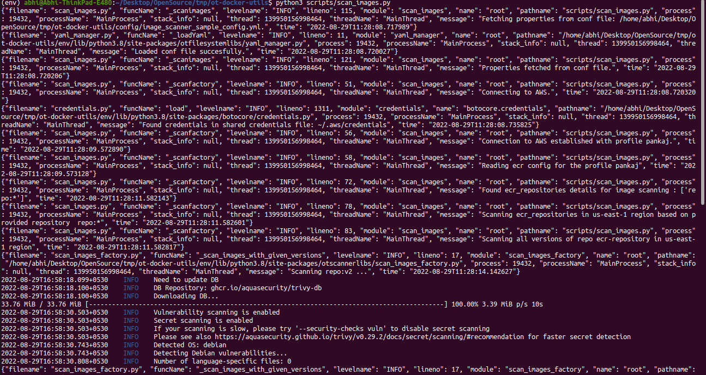
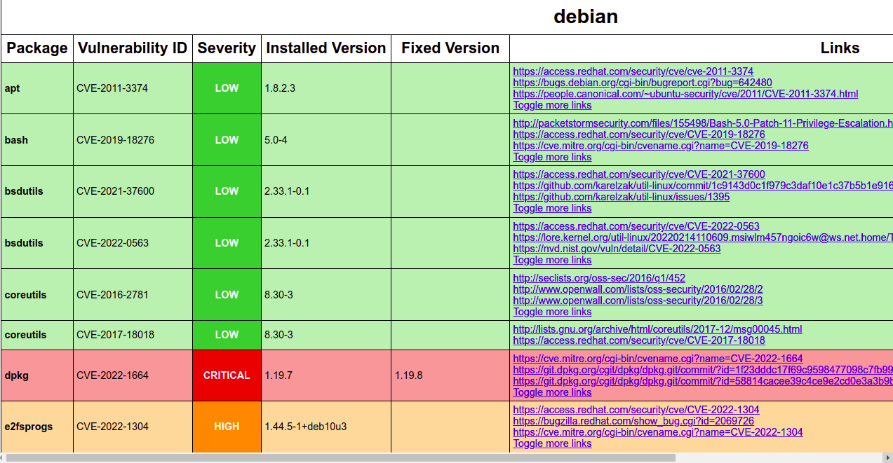

# Images  Scanning utility

## Images scanning utility :-<br/>
In this utility of current version we can scan  the images present on the
AWS ECR based on the images name and images versions provided in config as yaml.


## Prerequisite
- [Docker](https://docs.docker.com/engine/install/)
- [Trivy Tool](https://github.com/aquasecurity/trivy)
- [AWS Configure](https://docs.aws.amazon.com/cli/latest/userguide/getting-started-quickstart.html)

## Config File
  ```
  ecr:
    aws_profiles:
        default:
            aws_regions:
                us-east-2:
                    repositories:
                    - repo:version
                    - repo:*

  ```
### Note:-
In the above config section we can mention the multiple aws_profiles, multiple regions and multiple repositories:

- For the mutilple aws_profile config file will be look like below:- 
```
ecr:
    aws_profiles:
        default:
            aws_regions:
                us-east-2:
                    repositories:
                    - repo:version
                    - repo:*
        opstree:
            aws_regions:
                us-east-1:
                    repositories:
                    - repo:version
                    - repo:*
```
- For the mutilple aws_regions config file will be look like below:-
```
ecr:
    aws_profiles:
        default:
            aws_regions:
                us-east-2:
                    repositories:
                    - repo:version
                    - repo:*
                us-east-1:
                    repositories:
                    - repo:version
                    - repo:*
```
- For the mutilple aws_regions config file will be look like below:- <br/>
Note:- <br/>
To scan the specfic version of the given image, mention like "repo:version" <br/>
To scan all the versions of given images mention like "repo:*"

```
ecr:
    aws_profiles:
        default:
            aws_regions:
                us-east-2:
                    repositories:
                    - repo:version
                    - repo:*
```

### Example 
#### Config file with mutiple aws_profiles, aws_regions and repostiories are :- 
```
ecr:
    aws_profiles:
        default:
            aws_regions:
                us-east-1:
                    repositories:
                    - repo:version
                    - repo:*
                us-east-2:
                    repositories:
                    - repo:version
                    - repo:*
        opstree:
            aws_regions:
                us-east-1:
                    repositories:
                    - repo:version
                    - repo:*
                us-east-2:
                    repositories:
                    - repo:version
                    - repo:*
```

## Steps to run the utility on locally
- Install [Docker](https://docs.docker.com/engine/install/)
- Install [Trivy Tool](https://github.com/aquasecurity/trivy)
- Clone the repository(branch-> dev) [Repo](https://github.com/OT-PYTHON-UTILS/ot-docker-utils.git)
- Install all packages mention in the requirements.txt

- Export config file as environment variable by following command <br/>
    ```
    export CONF_PATH="${pwd}/config/image_scanner_sample_config.yml"
    ```
- Run the utility via  following command<br/>
    ```
    python3 scripts/scan_images.py
    ```
## Steps to run the utility via Docker
- Export the config file path via below command:
  ```
  export CONF_PATH="${pwd}/config/image_scanner_sample_config.yml"
  ```
- Run the command to build the image by following command:
    ```
    docker build -t opstree/image_scanner:1.0 -f Dockerfile .
    ```
- Run the docker images of above one created by following command:
    ```
    docker run -it --rm --name image_scanner -v ${CONF_PATH}:/etc/image_scanner_config.yml:ro -e CONF_PATH='/etc/image_scanner_config.yml' -v ~/.aws:/root/.aws -v  /var/run/docker.sock:/var/run/docker.sock opstree/image_scanner:1.0
    ```

## Output
- Scanning Logs


- HTML Report

