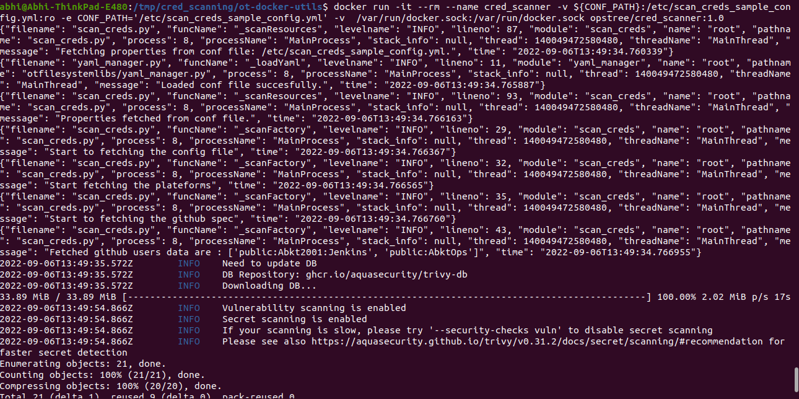

# Cred  Scanning utility

## Cred scanning utility :-<br/>
In this utility of current version we can scan the public repositories of Github and GitLab on the basis of username, repository name and organisation name provided in config as yaml.


## Prerequisite
- [Docker](https://docs.docker.com/engine/install/)
- [Trivy Tool](https://github.com/aquasecurity/trivy)


## Config File
  ```
  repositories:
    specs:
        plateforms:
            github:
                users:
                    - public:Abkt2001:Jenkins       #public:user:repo
                    - public:AbktOps                #no repo means will scan all repo

                organisations:
                    - public:AbktOps:OT-TRAINING:spinnaker-study      #public:user:org:repo
                    - public:AbktOps:OT-TRAINING                      #no repo means will scan all repo

            gitlab:
                users:
                    - public:abhiGurukulam

                organisations:
  ```
### Note:-
In the above config section we can mention the multiple repositories in the two way:
1. <b>public:usern_name:repo</b> <br/>
    Here, In this format replace the user_name with your github or gitlab user_name and replace repo with your repository name which you want to scan.
2. <b>public:usern_name</b> <br/>
    Here, In this format replace the user_name with your github or gitlab user_name. It will scan all the public repository present in the given user_name.

### Example 
#### Config file with mutiple repostiories are :- 
```
repositories:
    specs:
        plateforms:
            github:
                users:
                    - public:Abkt2001:Jenkins       #mode:user:repo
                    - public:AbktOps                #no repo means will scan all repo

                organisations:
                    - public:AbktOps:OT-TRAINING:spinnaker-study      # - user:org:public/priv:repo
                    - public:AbktOps:OT-TRAINING

            gitlab:
                users:
                    - public:abhiGurukulam

                organisations:
```

## Steps to run the utility on locally
- Install [Docker](https://docs.docker.com/engine/install/)
- Install [Trivy Tool](https://github.com/aquasecurity/trivy)
- Clone the repository(branch-> creds_scanning) [Repo](https://github.com/OT-PYTHON-UTILS/ot-docker-utils.git)
- Install all packages mention in the requirements.txt

- Export config file as environment variable by following command <br/>
    ```
    export CONF_PATH="${pwd}/config/scan_creds_sample_config.yml"
    ```
- Run the utility via  following command<br/>
    ```
    python3 scripts/scan_creds.py
    ```

## Steps to run the utility via Docker
- Export the config file path via below command:
  ```
  export CONF_PATH="${pwd}/config/scan_creds_sample_config.yml"
  ```
- Run the command to build the image by following command:
    ```
    docker build -t opstree/cred_scanner:1.0 -f Dockerfile .
    ```
- Run the docker images of above one created by following command:
    ```
    docker run -it --rm --name cred_scanner -v ${CONF_PATH}:/etc/scan_creds_sample_config.yml:ro -e CONF_PATH='/etc/scan_creds_sample_config.yml' -v  /var/run/docker.sock:/var/run/docker.sock opstree/cred_scanner:1.0
    ```
## Output
- Scanning Logs


